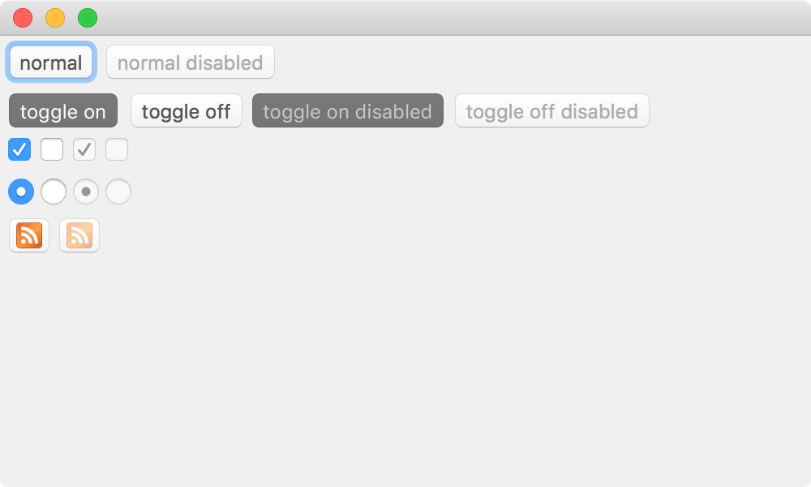

# Examples of buttons in Tint

This example shows variations of the [Button](https://www.trueinteractions.com/tint2/docs/Button.html) component.



## What does it do ? ##

1. Creates a windowed application.
2. Creates variations of the button component. 

## How do i run it? ##

1. Clone down this repo.
2. Install tint from https://github.com/trueinteractions/tint2/releases
3. At the command line run ```tint main.js``` in the cloned repo.
4. Have fun! Read about Tint in more depth at: https://www.trueinteractions.com/docs/
